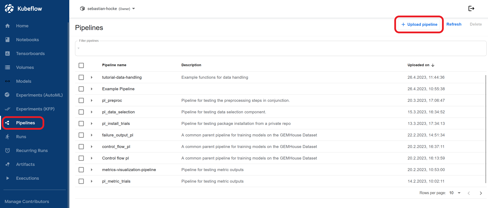
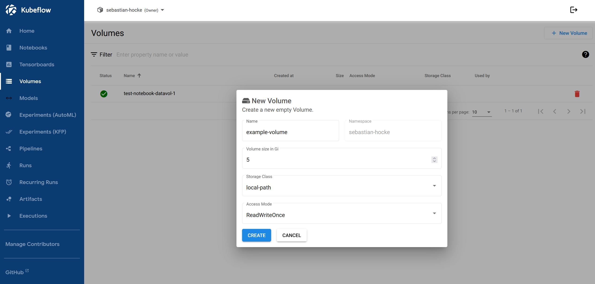

# Prerequisites
- some python experience
- Install `kfp` in your python environment: `pip install kfp==1.8.22`
- Install the kfpv1helper package to run pipelines remotely: `pip install 'git+https://github.com/sebh96/kfpv1helpers.git'`

# Writing and compiling basic python-function-based components and pipelines and passing data between components
1. As a starting point to learn more about Kubeflow pipelines we first showcase a simple pipeline setup that multiplies a user input and passes its result to a text file. For this step open **~/pipelines/data_handling.py**.
<br/><br/>
2. The file is structured in 3 overlying categories:
    - **Pipeline functions** contains the functions we use to create the pipeline
    - **Functions to pipeline components** contains the conversion to a pipeline component for each function.
    - **Pipeline creation** contains the pipeline function and compiles it to a .yaml file to upload to Kubeflow
<br/><br/>
3. In Line 80 `package_path='test_pipeline.yaml'` change the value to the desired path for your *pipeline.yaml* file and execute the python script. The resutling file can be uploaded manually in the Kubeflow web UI.

Fill out the necessary text fields, tick `Upload a file`, select the previously created *pipeline.yaml* file and click `create`. The pipeline should now appear in the `Pipelines`-section under your chosen name.
<br/><br/>
4. To test the pipeline, click on the name of your pipeline, choose `+ Create experiment`, choose a name for the experiment and click `create`. This should automatically open the `Start a run`-formular. Fill out the necessary text fields, specify your run parameters (numeric values) and click start. The execution result of your pipeline should now be visible in the `Run`-section of Kubeflow.
<br/><br/>
5. Back to the python code of the pipeline --> The heart of the pipeline is the `test_pipeline`-function, decorated with `@kfp.dsl.pipeline(name='')`. Here we determine the components of the pipeline, the order of execution and the parameters that will be given to each component. The output(s) of each component can be accessed with `example_task.outputs['value']` when the function has multiple outputs (showcased in `multiply`) or just `example_task.output` in case of a single output (showcased in `get_text_file`).
<br/><br/>
6. The functions `write_result_to_text` and `get_text_file` demonstrate the concept of data as file. This is realized by annotating the output as `OutputPath()` and feeding ist to another component as `InputPath()`. The paths for the input and output files will be chosen by the system and are passed as strings. When converting a function to a component the "\_path" and "\_file" suffixes are stripped from file/path inputs and output names e.g. `text_file` become `text`.


## Uploading and deleting pipelines and pipeline versions using the kfp helpers package
When using the kfpv1helper package (`pip install 'git+https://github.com/sebh96/kfpv1helpers.git'`) you can upload and run pipelines remotely directly from your python code.
Go to the data_handling example and uncomment this code inside the main function: 
```python
from kfpv1helper import kfphelpers

helper = kfphelpers(namespace='workshop', pl_name='data-handling')
helper.upload_pipeline(pipeline_function=test_pipeline)
helper.create_run(pipeline_function=test_pipeline, experiment_name='test')
```
When executing the code now a link to the DeployKF dashboard will appear in the terminal. Follow this link, login into your account and paste the key into your terminal.
You are now authorized to upload pipelines remotely. After execution you should see the *data-handling* pipeline listed in the Kubeflow UI/pipelines, as well as a new run in the Kubeflow UI/runs. Experiments specified in the `create_run()`-function are created automatically.

The other pipelines in this repository will all be uploaded/run this way.

# Modifying tasks
## Mounting volumes, structuring pipelines and data visualization
This section will showcase how to mount a volume to a pipeline component and visualize some example data retrieved from the volume.

1. Open the file **~/pipelines/data_visualization.py**. 

2. In the `data_visualization()`-function we apply a **RAW_DATA_VOLUME** to our tasks `..._task.apply(RAW_VOLUME_MOUNT)`. For this we need to get the *pvc_name* and the *volume-name* from the Kubeflow Volume Interface and set the *volume_mount_path* according to our given paths. Volumes have to be created for each kubeflow namespace, so we need to create a new volume in the web UI. In the web ui choose the **Volumes**-segment and create a new volume.


3. Now we need to get the example data for the pipeline to the volume. At this point we need to take a look into the pipeline itself. First we take a look at the pipeline components in **~/pipeline/data_visualization.py**. Here we have the following components:
    * `get_example_data_to_volume`: Uses *requests* to download a file from the `url` and save it to the specified `save_path` on our mounted volume.
    * `display_image_from_path`: Uses *pillow*, *numpy*, *matplotlib* and *mpld3* to visualize an image from path. The python packages have to be imported in the component declaration `create_component_from_func` as follows: `packages_to_install=['numpy','pillow','matplotlib','mpld3']`. To visualize the image in the visualization tab, we plot the image using *matplotlib* and convert it with *mpld3* to html. To display this html code in Kubeflow, we need to define it as a *web-app* using the `metadata`-JSON structure and dump it it as `OutputPath()`. You can find some other types of visualization like *ROC curve*, *Tables* or *Confusion matrix* in the [Kubeflow documentation](https://www.kubeflow.org/docs/components/pipelines/v1/sdk/output-viewer/). 
    * `plot_csv_from_path`: Uses pandas to read a csv file from the mounted volume and plots it using *matplotlib* and *mpld3*. We apply the same method from `display_image_from_path` and convert the figure to html and save it as web-app using the `metadata` JSON structure.

4. In the `data_visualization()`-pipeline function we structure these components using the the `.after()`-method. This ensures that each visualization component only gets executed, after the download of the file was successful. Since we do not use the output of functions, we need to connect the components manually.

5. Run the pipeline using `upload_and_run.py`. In the web ui open your pipeline run and click on the visualization tab of the visualization components to see the results.

## Using GPUs to train models and visualize results (PreReq: Mounting volumes, structuring pipelines and data visualization)
This section showcases how to write a simple ML pipeline using the ultralytics YOLO library. For this example it is recommended to create a jupyter notebook and mount the jupyter volume to your pipeline to browse the results of the `yolo_train` function with the built-in file explorer.

1. Open **~/pipelines/yolo_object_detection.py**. Here we have the following pipeline components:
    * `gpu_available_check`: Checks if GPU is available by running nvidia-smi using the YOLO image from Harbor.
    * `yolo_train`: Starts training with the given parameters. The ultralytics train function automatically saves runs in *../runs/train/*, so we save the results in the defined `save_path` on a mounted volume.
    * `yolo_predict`: Predicts on input image `predict_data` (path or url) by using the checkpoint created by `yolo_train`, which it loads from the mounted volume. The prediction will be output as a pickled file for later use.
    * `draw_bbox`: Uses `predict_yolo`-output to draw bounding boxes around detected objects on the input image for the prediction.
    * `visualize_image`: Visualizes output image from `draw_bbox` in the visualization tab.
    * `tensorboard_visualization`: Demonstrates Tensorboard use inside of the pipeline visualization tab. This can bes used as an alternative to the Tensorboard-section in the Kubeflow Web UI to only visualize the metrics of specific components.

2. Take a look at `yolo_object_detection`-pipeline function. The pipeline is constructed using the methods we learned in the previous tutorials, except for `.set_gpu_limit(1)`, which assigns the `yolo_train` and `yolo_predict` function *1* GPU from the Cluster.

3. Run the pipeline and inspect the results in the Kubeflow UI, MLflow and/or the notebook/vscode file explorer. 

# Tensorboard usage (prereq: Yolo pipeline)

1. In the web ui of Kubeflow -- Got to the Tensorboard section and click `+ New TensorBoard`. 

2. Choose a name for your TensorBoard and configure it to use the volume(*PVC*) where you save the TensorBoard files/results for your pipeline runs. For the `mount_path` choose the exact directory containing the TensorBoard files on the volume.
   
## Changing display names
To change the name of any task/component in a pipeline, you can set: *component*`.set_display_name('Your name for the component')`

## Recursion, conditions and exit handlers to the control flow of a pipeline
`DSL conditions` allow us to execute tasks based on the output of an previous task. `DSL exit handlers` allows us to specifiy an exit-task, which will run even if one of the previuos tasks fails.

1. Open **~/pipelines/conditions_and_exit_handling.py**. Here we define the following pipeline components:
    * `check_if_prime`: Returns True if input is a prime number, else return False
    * `sub_one`: Substracts one from input number. Done this way, because we can't perform mathematical operations on Pipeline Parameters in the Pipeline Function.
    * `cs_print`: Simple component to print and return result.
    * `exit_task`: Demonstrates exit_handling. This Component will always execute, even if previous taks fail.
    * **`find_next_prime`**: Utilizes `dsl.Condition` to recursively call itself and check if the next lower integer is a prime number. 

2. Open **~\src\pipelines\example_pipelines.py** and take a look a the function for `recursion_conditions_and_exit_handlers`. 


