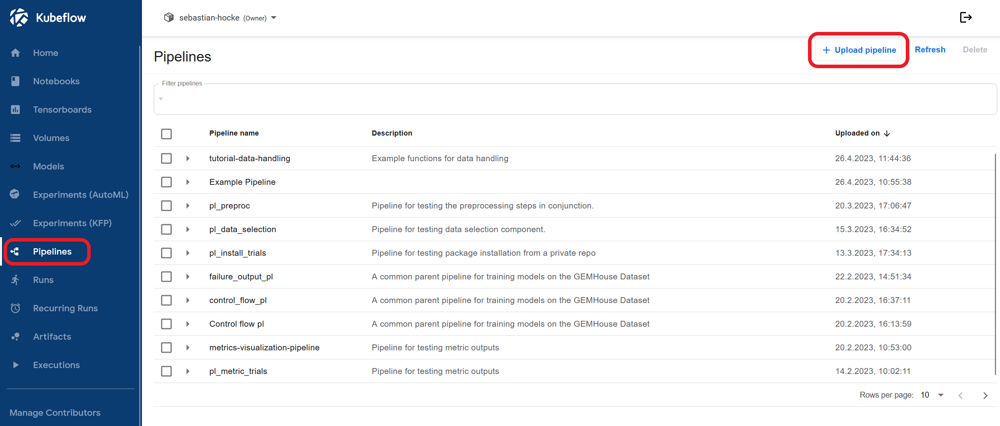
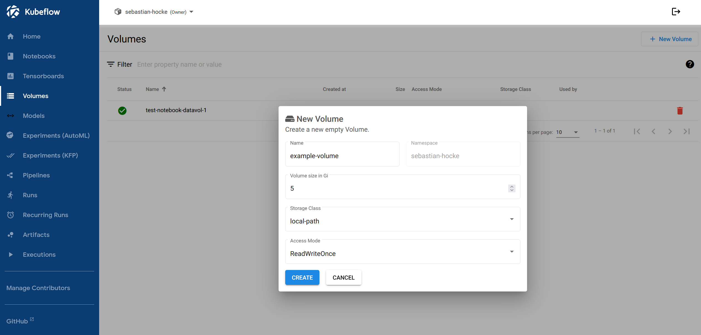

# Prerequisites
- some python experience
- clone or fork this repository
- Install `kfp` in your python environment: `pip install kfp`

# Writing and compiling basic python-function-based components and pipelines and passing data between components
1. As a starting point to learn more about Kubeflow pipelines we first showcase a simple pipeline setup that multiplies a user input and passes its result to a text file. For this step open **~/src/components/data_handling.py**.
>**⚠ WARNING** : If you want to change anything , please create a copy of the file since it is needed for later examples of Kubeflow.
<br/><br/>
2. The file is structured in 3 overlying categories:
    - **Pipeline functions** contains the functions we use to create the pipeline
    - **Functions to pipeline components** contains the conversion to a pipeline component for each function.
    - **Pipeline creation** contains the pipeline function and compiles it to a .yaml file to upload to Kubeflow
<br/><br/>
3. In Line 70 `package_path='test_pipeline.yaml'` change the value to the desired path for your *pipeline.yaml* file and execute the python script. The resutling file can be uploaded manually in the Kubeflow web UI.

Fill out the necessary text fields, tick `Upload a file`, select the previously created *pipeline.yaml* file and click `create`. The pipeline should now appear in the `Pipelines`-section under your chosen name.
<br/><br/>
4. To test the pipeline, click on the name of your pipeline, choose `+ Create experiment`, choose a name for the experiment and click `create`. This should automatically open the `Start a run`-formular. Fill out the necessary text fields, specify your run parameters (numeric values) and click start. The execution result of your pipeline should now be visible in the `Run`-section of Kubeflow.
<br/><br/>
5. Back to the python code of the pipeline --> The heart of the pipeline is the `test_pipeline`-function, decorated with `@kfp.dsl.pipeline(name='')`. Here we determine the components of the pipeline, the order of execution and the parameters that will be given to each component. The output(s) of each compononent can be accessed with `example_task.outputs['value']` when the function has multiple outputs (showcased in `multiply`) or just `example_task.output` in case of a single output (showcased in `get_text_file`).
<br/><br/>
6. The functions `write_result_to_text` and `get_text_file` demonstrate the concept of data as file. This is realised by annotating the output as `OutputPath()` and feeding ist to another component as `InputPath()`. The paths for the input and output files will be chosen by the system and are passed as strings. When converting a function to a component the "\_path" and "\_file" suffixes are stripped from file/path inputs and output names e.g. `text_file` become `text`.


# Interacting with the Web API via KFP SDK
This section how to directly interact with the Kubeflow Web API for a simpler and quicker process when uploading and running your pipeline.

## Uploading and deleting pipelines and pipeline versions
### Uploading a pipeline
1. For this step open the file **~/src/api_controls/upload_and_run.py**. To run this file correctly it is necessary to create a file called **.env** in the folder of the script (**~/src/api_controls**). Paste the following text into the file and set the variables for your namespace, user and password.
```python
KFP_ENDPOINT='https://kubeflow.foresight-next.plaiful.org/pipeline'
KFP_NAMESPACE=<your kubeflow namespace>

KUBE_USER=<your kubeflow user name>
KUBE_PW=<your passwd>
```

2. The script is structured in a few functions to handle uploading and running your pipeline. We first take a look at the `main`-function to understand the process. The function starts by creating a path (/and folder) folder for the pipeline manifest(*your_pipeline.yaml*), so we can pass the *path* in later steps. After that we pass this path and the pipeline function (imported from **~/src/components/example_pipelines.py**) to the compiler, to compile the *your_pipeline.yaml* to the chosen manifest path:
´´`
kfp.compiler.Compiler().compile(pipeline_func=data_visualization, package_path=pl_package)
`´´
<br/><br/>
3. In the next step we need to connect to the web service of our Kubeflow cluster. Here we load the content of the in step 1. created *.env* file into the environment variables and pass it to the kfp.Client() class:
```python
client = kfp.Client(host=kfp_endpoint, existing_token=get_access_token(), namespace=kfp_namespace)
```
The `get_access_token()`-function requests an access token using your username and password from the *.env*-file
<br/><br/>

4. At this point we are ready to upload the pipeline to the Kubeflow cluster. For this we simply pass the `client` to the `pipeline_upload()`-function. The ´pipeline_upload()´-function will check if the pipeline already exists in the Kubeflow cluster, because it is not possible to upload multiple pipelines with the same name. To allow multiple versions of one pipeline(*with the same name*), it is necessary to upload it as a **new pipeline verion**. <br/><br/> If the pipeline does not exist yet, we use `client.upload_pipeline(pipeline_package_path=pl_package, pipeline_name=PL_NAME)`, where we pass the path of the *your_pipeline.yaml* `pl_package` and the name of the pipeline `PL_NAME`. If a pipeline with that exact name already exists we use `client.upload_pipeline_version(pipeline_package_path=pl_package, pipeline_name=PL_NAME, pipeline_version_name=PL_NAME+version)`, where we also pass a `pipeline_version_name`-parameter. This example script uses the number of already existing versions of the requested pipeline to determine the name(/number) of the pipeline_version that will be uploaded.


## Creating experiments and starting runs
The next step in the `main`-function is create a experiment for the  pipeline and run it.
<br/><br/>
1. For this we need to set the name of the experiment `experiment_name` and the parameters for the run `run_parameters`. The run parameters need to fit the pipeline we are using and will be passed as a dictionary, along with the experiment name and path of the *your_pipeline.yaml* to the `run_pipeline`-function. 
<br/><br/>
2. The `run_pipeline`-function will first check if the experiment we want to use already exists, by looping over the existing experiment list in the `get_exp_id`-function and if it does will save it into `exp_id`-variable. If it does not exist it will create a new experiment and save its id.
<br/><br/>
3. After fetching/creating the experiment, we use the `client.run_pipeline()`-function and pass it the path of *your_pipeline.yaml*, the experiment_id `exp_id`, the run parameters `run_params` and the name of the job `job_name`(consisting of the name of the pipeline and the current time and date) to upload the run to the Kubeflow cluster. 
>**⚠ WARNING** : Creating a run this way will use the pipeline defined by *your_pipeline.yaml*-file. Not the (eventually) existing pipeline on the cluster.

# Modifying tasks
## Mounting volumes, structuring pipelines and data visualization
This section will showcase how to mount a volume to a pipeline component and visualize some example data retrieved from the volume.
<br/><br/>
1. For this step we will use a different pipeline function. Change the `pipeline_func` (*line 97*) in the **~/src/api_controls/upload_and_run.py** to  
```
kfp.compiler.Compiler().compile(pipeline_func=data_visualization, package_path=pl_package)
```

* We also need to change the run parametes `run_params` accordingly. Just comment the `run_params` for the `data_handling`-example and uncomment the `run_params` with the empty dictionary. The default parameters are defined in the pipeline functions itself.
<br/><br/>

2. Open the file **~/src/pipelines/example_pipelines.py**. Here are all pipeline function defined that are used in this Tutorial. You should be already familiar with the basic structure of such a function from the first section(*Writing and compiling basic python-function-based components..*). For this example we are only interested in the `data_visualization()`-function and its underlying components.
<br/><br/>

3. In the `data_visualization()`-function we apply a **RAW_DATA_VOLUME** to our tasks `..._task.apply(RAW_VOLUME_MOUNT)`. This volume is defined in **~/src/api_controls/volume_mount.py**. Volumes have to be created for each kubeflow namespace, so we need to create a new volume in the web UI. In the web ui choose the **Volumes**-segment and create a new volume.

After the volume is mounted click on it and copy the *volume name*. Open **~/src/api_controls/volume_mount.py** and insert the *volume name* in `RAW_DATA_VOL` and the name of the volume you have chosen yourself in `RAW_DATA_PVC`. For the mounting point we use `/usr/share/example-pipeline-volume`, keep in mind that you need to change your InputPaths accordingly if you want to change it.
<br/><br/>

4. Now we need to get the example data for the pipeline to the volume. At this point we need to take a look into the pipeline itself. First we take a look at the pipeline components in **~/src/components/data_visualzaion.py**. Here we have the following components:
    * `get_example_data_to_volume`: Uses *requests* to download a file from the `url` and save it to the specified `save_path` on our mounted volume.<br/><br/>
    * `display_image_from_path`: Uses *pillow*, *numpy*, *matplotlib* and *mpld3* to visualize an image from path. The python packages have to be imported in the component declaration `create_component_from_func` as follows: `packages_to_install=['numpy','pillow','matplotlib','mpld3']`. To visualize the image in the visualization tab, we plot the image using *matplotlib* and convert it with *mpld3* to html. To display this html code in Kubeflow, we need to define it as a *web-app* using the `metadata`-JSON structure and dump it it as `OutputPath()`. You can find some other types of visualization like *ROC curve*, *Tables* or *Confusion matrix* in the [Kubeflow documentation](https://www.kubeflow.org/docs/components/pipelines/v1/sdk/output-viewer/). 
    <br/><br/>
    * `plot_csv_from_path`: Uses pandas to read a csv file from the mounted volume and plots it using *matplotlib* and *mpld3*. We apply the same method from `display_image_from_path` and convert the figure to html and save it as web-app using the `metadata` JSON structure.
    <br/><br/>

5. In the `data_visualization()`-pipeline function (in **~/src/pipelines/example_pipelines.py**) we structure these components using the the `.after()`-method. This ensures that each visualization component only gets executed, after the download of the file was successful. Since we do not use the output of functions, we need to connect the components manually.
<br/><br/>

6. Run the pipeline using `upload_and_run.py`. In the web ui open your pipeline run and click on the visualization tab of the visualization components to see the results.
<br/><br/>

## Using GPUs to train models and visualize results (PreReq: Mounting volumes, structuring pipelines and data visualization)
This section showcases how to write a simple ML pipeline using the ultralytics YOLO library.

1. First we will change the pipeline function in **~/src/api_controls/upload_and_run.py** to `yolo_object_detection` and make sure that the `run_params`-dict is empty. 

2. Open **~/src/components/yolo_object_detection.py**. Here we have the following pipeline components:
    * `gpu_available_check`: Checks if GPU is available by running nvidia-smi using the YOLO image from Harbor.
    * `yolo_train`: Starts training with the given parameters. The ultralytics train function automatically saves runs in *../runs/train/*, so we save the results in the defined `save_path` on a mounted volume.
    * `yolo_predict`: Predicts on input image `predict_data` (path or url) by using the checkpoint created by `yolo_train`, which it loads from the mounted volume. The prediction will be output as a pickled file for later use.
    * `draw_bbox`: Uses `predict_yolo`-output to draw bounding boxes around detected objects on the input image for the prediction.
    * `visualize_image`: Visualizes output image from `draw_bbox` in the visualization tab.
    * `tensorboard_visualization`: Demonstrates Tensorboard use inside of the pipeline visualization tab. This can bes used as an alternative to the Tensorboard-section in the Kubeflow Web UI to only visualize the metrics of specific components.

3. Take a look at `yolo_object_detection`-pipeline function (in **~/src/pipelines/example_pipelines.py**). The pipeline is constructed using the methods we learned in the previous tutorials, except for `.set_gpu_limit(1)`, which assigns the `yolo_train` and `yolo_predict` function *1* GPU from the Cluster.

4. Run the pipeline and see the Results in the Web UI. To see the results of the `yolo_train`, it is possible to mount your existing volume to a new jupyter notebook(/VScode/R Studio) in the Web UI and browse its contents using the built in file explorer.

## Changing display names
To change the name of any task/component in a pipeline, you can set: *component*`.set_display_name('Your name for the component')`

## Giving access to private libraries (More about GitLab than about KFP)
**Tutorial currently located at [kfp_helpers](https://gitlab.com/team-ft/cis-utils/kfp_helpers)** 
- Python Packge(private in gitlab) -> Kubeflow access (GitLab: Settings/Repository/deploy tokens) // Kubernetes secrets (in mount.py file)

## Recursion, conditions and exit handlers to the control flow of a pipeline
`DSL conditions` allow us to execute tasks based on the output of an previous task. `DSL exit handlers` allows us to specifiy an exit-task, which will run even if one of the previuos tasks fails.

1. Change the pipeline function in **~/src/api_controls/upload_and_run.py** to `recursion_conditions_and_exit_handlers` and open **~/src/components/conditions_and_exit_handling.py**. Here we define the following pipeline components:
    * `check_if_prime`: Returns True if input is a prime number, else return False
    * `sub_one`: Substracts one from input number. Done this way, because we can't perform mathematical operations on Pipeline Parameters in the Pipeline Function.
    * `cs_print`: Simple component to print and return result.
    * `exit_task`: Demonstrates exit_handling. This Component will always execute, even if previous taks fail.
    * **`find_next_prime`**: Utilizes `dsl.Condition` to recursively call itself and check if the next lower integer is a prime number. 

2. Open **~\src\pipelines\example_pipelines.py** and take a look a the function for `recursion_conditions_and_exit_handlers`. 


# Tensorboard usage (prereq: Yolo pipeline)

1. In the web ui of Kubeflow -- Got to the Tensorboard section and click `+ New TensorBoard`. 

2. Choose a name for your TensorBoard and configure it to use the volume(*PVC*) where you save the TensorBoard files/results for your pipeline runs. For the `mount_path` choose the exact directory containing the TensorBoard files on the volume.

3. **TBD**


# Uploading images to harbor

1. Make sure you have access to [Harbor](https://harbor.foresight-next.plaiful.org). Choose *Login via OIDC Provider* and sign in with you Keycloak credentials(the same as for Kubeflow etc.).

2. In the web UI got to the *Projects*-section, click *+ New Project*, choose a name and create a new project. Navigate to your newly created repository download the *registry certificate*. Add the certificate to the corresponding folder for your local container management solution (for podman the file should be added here: `\etc\containers\certs.d\harbor.foresight-next.plaiful.org\YOUR_CERTIFICATE.crt`).

3. You can find the user information for the client in the top right of the web UI under *User Profile*. Use the Username and the CLI secret to login to Harbor from your client (e.g. `docker login https://harbor.foresight-next.plaiful.org`,`podman login https://harbor.foresight-next.plaiful.org`,...). 

4. Now you are able to access Harbor from your container management solution. You can find a few examples for some containering solutions on how to push an image in your project folder under *Push Command* (e.g. `docker push *YOUR_IMAGE_ID* harbor.foresight-next.plaiful.org/YOUR_REPOSITORY/REPOSITORY[:TAG]`). 

5. After the uploading process is done you should find your image in your harbor repository. To use the image for a Kubeflow pipeline component use the FULL LINK of the image (e.g. *harbor.foresight-next.plaiful.org/YOUR_REPOSITORY/REPOSITORY[:TAG]*). **TBD**

